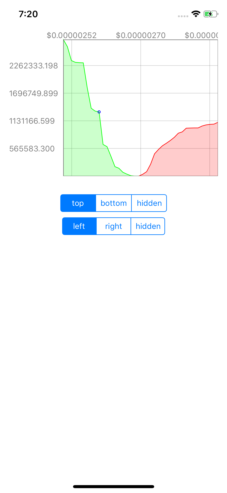
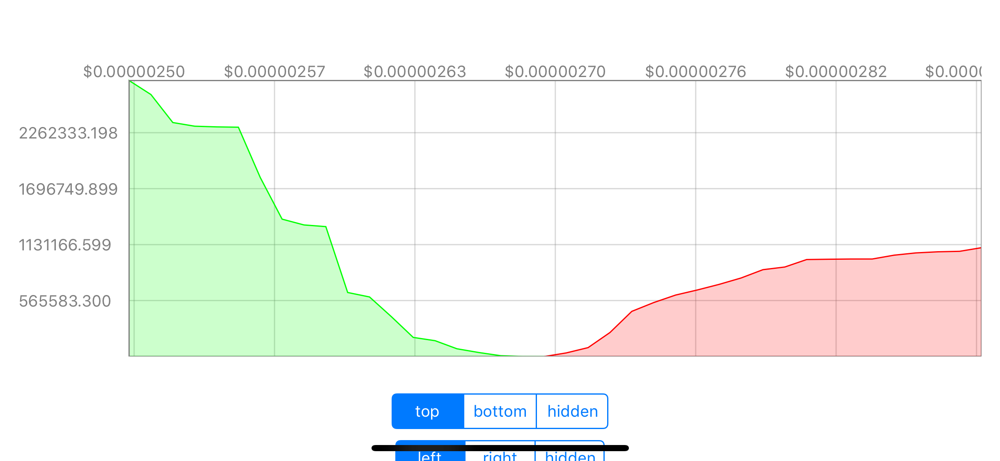

# SwiftDepthChart v0.1

<p align="center">


<a href="https://developer.apple.com/swift"></a>

</p>




This library includes a chart to display accumulated orders in a high-customazible, interactive and Auto Layout capable way.

## Installation
Just drag and drop the directory DepthChart into your existing project and start using it directly.

## Examples
You can view and run the example application. Just compile this project.

Otherwise usage is as follows: 
```Swift
private let depthChart = DepthChart()

// ... in intialization add the following:

// add buy orders
depthChart.data.addBuyOrder(with: price, amount: amount)

// add sell orders
depthChart.data.addSellOrder(with: price, amount: amount)

// style (refer to DepthChartStyle.swift)
depthChart.style.xAxisFont = UIFont.systemFont(ofSize: 11)
depthChart.style.yAxisFont = UIFont.systemFont(ofSize: 11)

// define the position of axes
depthChart.xAxisPosition = .top
depthChart.yAxisPosition = .left // or .hidden
```

By default, prices are formatted using two fraction digits (8.00 $). You can customize this behavior by providing a delegate:

```Swift
// ... in intialization add the following:
depthChart.delegate = self

// implement the following methods
func formatXLabel(for value: Double) -> String {
    let nf = NumberFormatter()
    nf.numberStyle = .currency
    // display 8 fraction digits
    nf.minimumFractionDigits = 8
    nf.maximumFractionDigits = 8
    return nf.string(from: NSNumber(value: value))!
}

```

## Disclaimer
Please understand I created this library within 6 hours of work. It may contain bugs or may be unoptimized.
Feel free to contribute.
